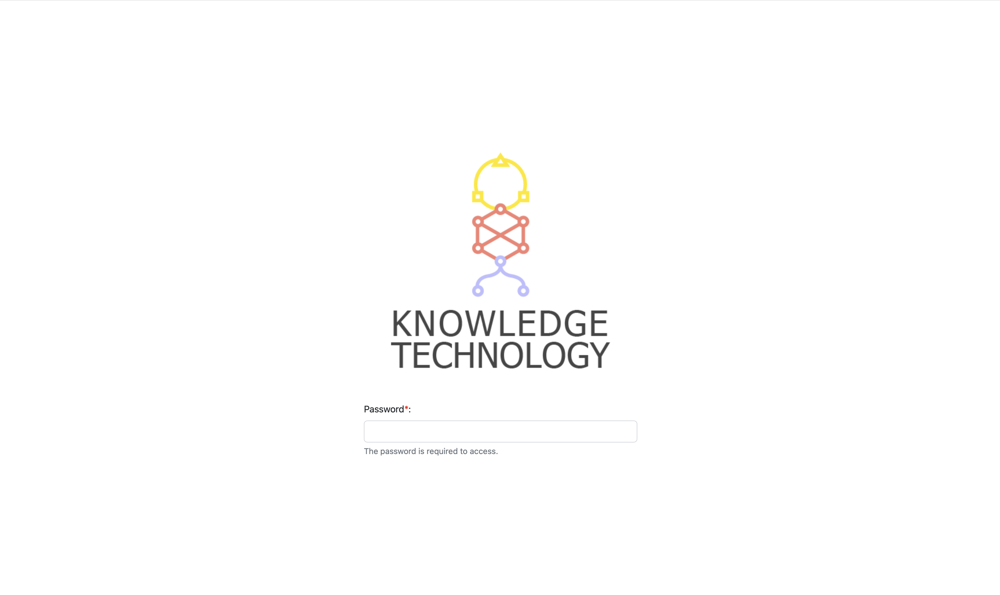
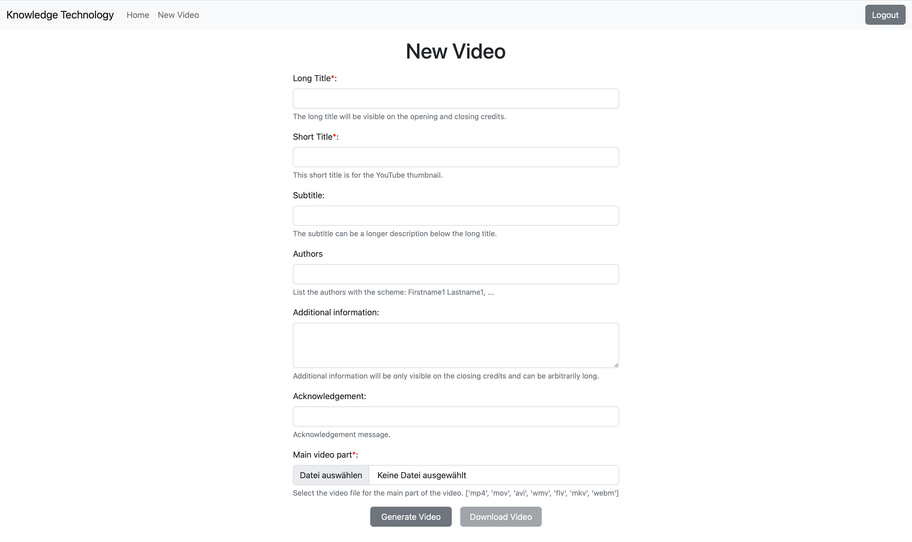
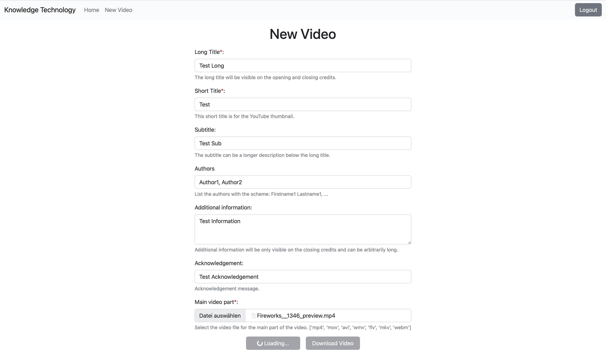
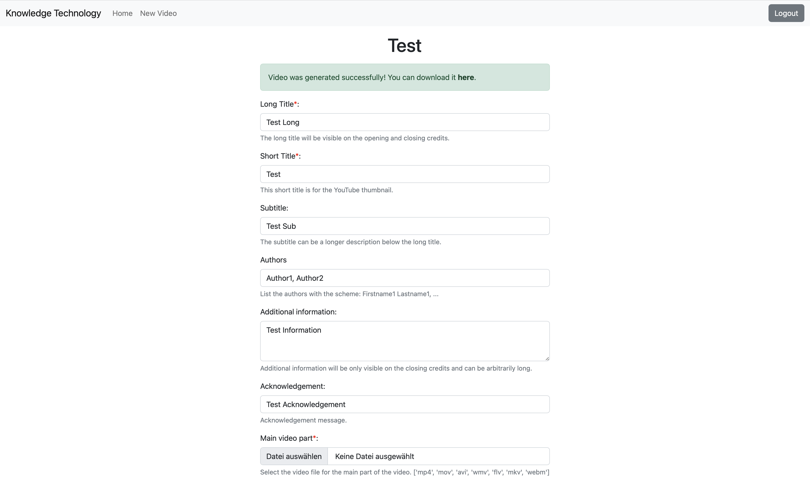
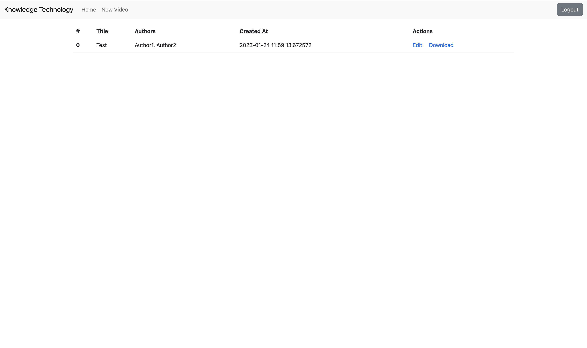

# Flask Moviepy Web Application

This is a simple Flask application that uses Moviepy to edit videos.
It is a simple web application that allows you to upload a video, specify text for the intro and outro, 
and then download the edited video. This application was developed to automate the video editing for videos uploaded 
to the [Knowledge Technology YouTube Channel](https://www.youtube.com/@knowledgetechnologyunivers2312). 
But it can be easily modified to suit your needs.

## Installation
1. Clone the repository
2. Install docker and docker-compose
3. Run `docker-compose up` in the root directory of the project
4. Open your browser and go to `localhost:80`

## Configuration
You can configure the application by editing the `config.ini` file and the `.env` file.
There you can set the password for the login page and the configuration for the database 
(Note if you cange the configuration for the database, you also need to change the `.env` file to match).

A nginx reverse proxy is used to serve the application. 
You can configure the nginx reverse proxy by editing the `nginx/nginx.conf` file.

The provided SSL certificates are self-signed and will not work on all browsers.
To use your own certificates, replace the files in the `nginx/certs` directory with your own.

More changes to the configuration can be made by editing the `docker-compose.yml` file and `Dockerfile`.

## How to use

Login Page: Use the password specified in the config.ini file to login.

New Video: If you want to create a new video, you can use this page. 
You can upload a video file and add a text to the video. 
After that, click the "Generate Video" button to create the video (Note: This process may take a while).
After the video is created, you can download the video by clicking the "Download Video" button.

Home: After you have created at least one video you can go to the home page.
This page shows all the videos that you have created. You can download the video by clicking the "Download" button or 
make further changes to the video by clicking the "Edit" button.

## License
This project is licensed under the terms of the MIT license.

